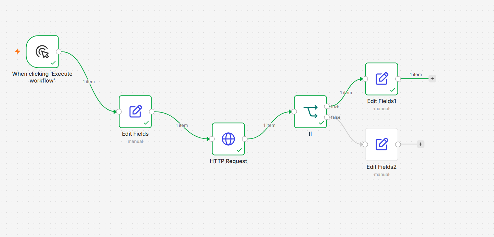
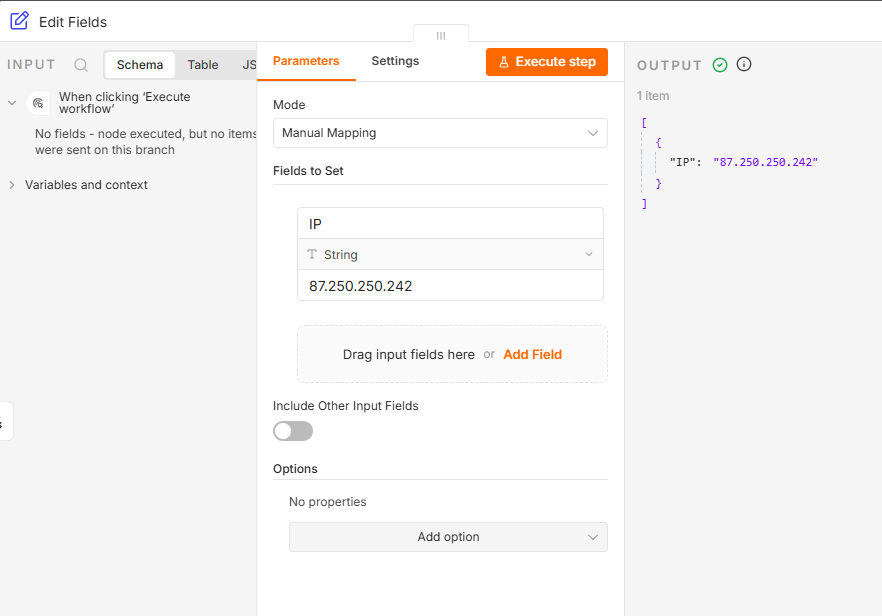
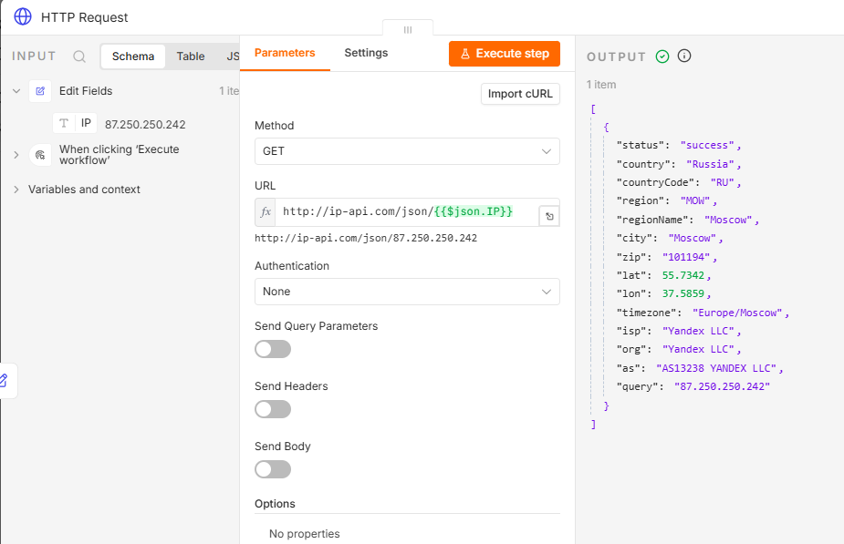
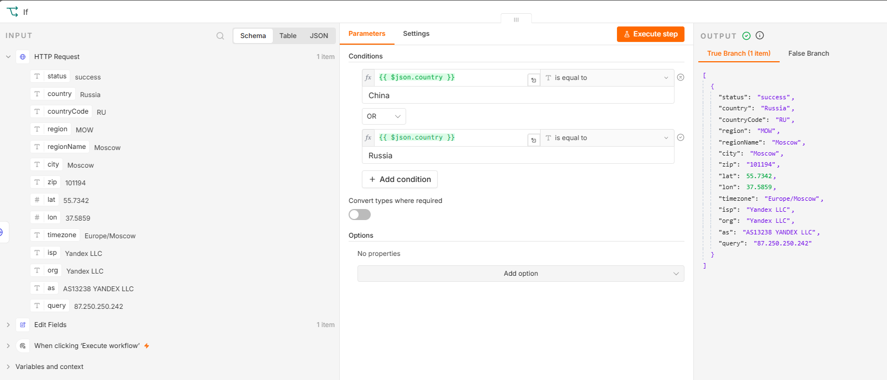
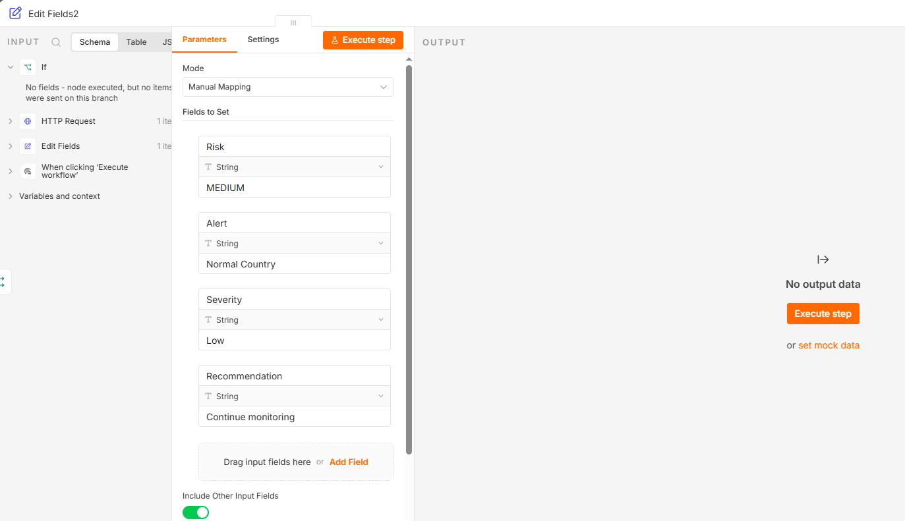

# SOC Automation with n8n


---

# Overview

This repository contains cybersecurity automation workflows built with **n8n** while learning Security Operations (SOC), Security Automation, APIs, and Threat Intelligence.

The objective of this project is to automate repetitive SOC analyst tasks that are commonly performed during alert investigation and incident triage.

Current workflow demonstrates:

- API Integration
- JSON Parsing
- Dynamic Variables
- Conditional Logic
- Threat Intelligence Enrichment
- Basic Risk Classification

---

# Project Goal

Build a collection of reusable SOC automation workflows that simulate real-world security operations.

The long-term objective is to automate tasks such as:

- Threat Intelligence Enrichment
- Windows Event Log Processing
- Wazuh Alert Automation
- VirusTotal Integration
- AbuseIPDB Integration
- MITRE ATT&CK Mapping
- AI Incident Summaries
- Automated Incident Reporting

---

# Current Workflow

## 01 - Threat Intelligence Lookup

This workflow performs a simple Threat Intelligence enrichment using a public GeoIP API.

### Workflow Logic

```

Manual Trigger

↓

Input IP Address

↓

HTTP Request (GeoIP API)

↓

Retrieve Country
Retrieve City
Retrieve ISP
Retrieve ASN

↓

IF Country == Russia OR China

↓

HIGH Risk

ELSE

↓

MEDIUM Risk

```

---

# Features

✅ Manual IP Input

✅ Dynamic API Request

✅ Automatic GeoIP Lookup

✅ JSON Response Processing

✅ Conditional Decision Making

✅ Automatic Risk Classification

---

# Technologies Used

- n8n Cloud
- REST APIs
- JSON
- HTTP Requests
- GeoIP API
- GitHub

---

# Skills Demonstrated

- Security Automation
- API Integration
- JSON Processing
- Conditional Logic
- Threat Intelligence Enrichment
- SOC Workflow Design
- Low-Code Automation

---

# Workflow Screenshots

## Complete Workflow



---

## Input IP Address

The workflow begins with a manually supplied IP address.



---

## GeoIP API Response

The HTTP Request node queries the GeoIP API and retrieves:

- Country
- Region
- City
- ISP
- ASN



---

## Conditional Logic

The IF node evaluates the country returned by the API.

If the country matches predefined values, the workflow follows the High Risk branch.

Otherwise it follows the Medium Risk branch.



---

## Risk Classification

Depending on the evaluation, the workflow enriches the alert with additional fields.

Example:

- Risk
- Alert
- Severity
- Recommendation



---

# Example Output

Example input

```

87.250.250.242

```

API returns

```

Country : Russia
City : Moscow
ISP : Yandex LLC

```

Workflow Result

```

Risk : HIGH
Severity : Critical
Recommendation : Investigate immediately

```

---

# Learning Objectives

This project helped me understand:

- Working with REST APIs
- Dynamic Variables in n8n
- JSON Responses
- Workflow Design
- Conditional Logic
- Security Automation Concepts

---

# Future Improvements

Planned workflows include:

- Windows Event Log Detection
- Brute Force Detection
- VirusTotal Lookup
- AbuseIPDB Integration
- MITRE ATT&CK Mapping
- Wazuh Alert Processing
- AI Alert Summarization
- Automatic GitHub Incident Reports
- Microsoft Teams Notifications
- Email Alerting

---

# Repository Structure

```

soc-automation-n8n

│

├── README.md

├── 02 - Threat Intelligence Lookup.json

├── screenshots01-workflow-overview.png

├── screenshots02-input-ip.png

├── screenshots03-geoip-api-result.png

├── screenshots04-if-condition.png

└── screenshots05-risk-output.png

```

---

# Author

**Fatme Ulanova**

GitHub

https://github.com/FatmeUlanova

LinkedIn

https://www.linkedin.com/in/fatme-ulanova-74477329a/

---

# Disclaimer

This project was created for educational and portfolio purposes while learning cybersecurity automation with n8n.

The workflow demonstrates automation concepts and should not be considered a production-ready threat detection solution.

---
